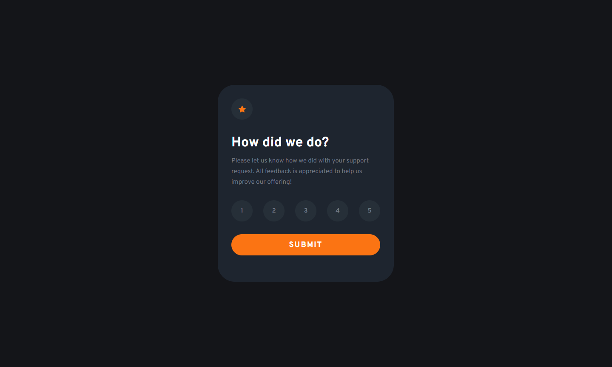
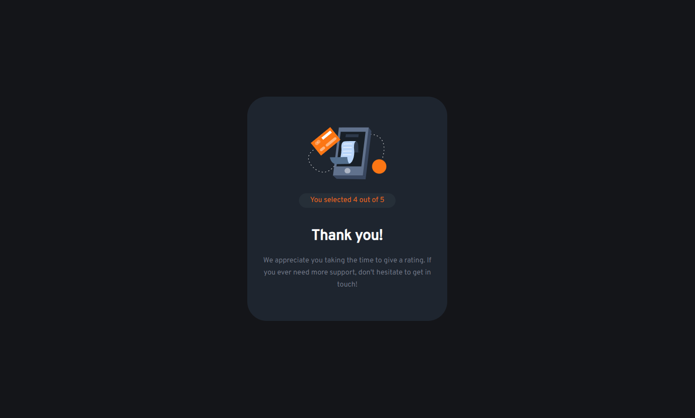

# Frontend Mentor - Interactive rating component solution

This is a solution to the [Interactive rating component challenge on Frontend Mentor](https://www.frontendmentor.io/challenges/interactive-rating-component-koxpeBUmI). Frontend Mentor challenges help you improve your coding skills by building realistic projects. 

## Table of contents

- [Overview](#overview)
  - [The challenge](#the-challenge)
  - [Screenshot](#screenshot)
  - [Links](#links)
- [My process](#my-process)
  - [Built with](#built-with)
  - [What I learned](#what-i-learned)
- [Author](#author)
- [Acknowledgments](#acknowledgments)

## Overview

### The challenge

Users should be able to:

- View the optimal layout for the app depending on their device's screen size
- See hover states for all interactive elements on the page
- Select and submit a number rating
- See the "Thank you" card state after submitting a rating

### Screenshots

### Links

- Live Site URL: [Rating Component](https://rkendall300.github.io/interactive-rating-component/)

## My process

### Built with

- Semantic HTML5 markup
- CSS custom properties
- Flexbox
- Mobile-first workflow
- [React](https://reactjs.org/) - JS library

### What I learned

The most important part of this project was getting the states to work across multiple pages. In a previous project, I split the pages into separate files and linked them through imports, but this time I wanted to try and do everything in one file since it wouldn't be too large or confusing to handle. I will probably continue to put everything in one file until I have a lot of components working together.

## Author

- Frontend Mentor - [@rkendall300](https://www.frontendmentor.io/profile/rkendall300)

## Acknowledgments

Of course, thanks to my friend Eric for all the help with frontend development so far! Hopefully I will continue to pump out these solutions and maybe teach him something instead.
